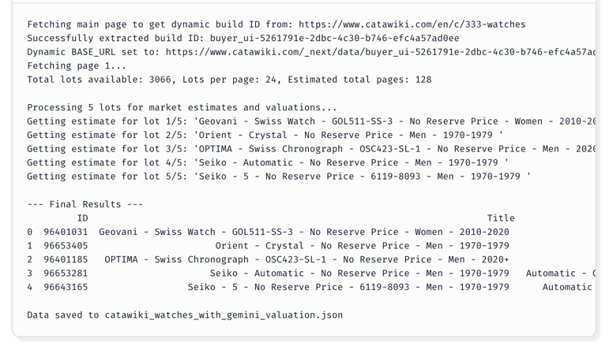
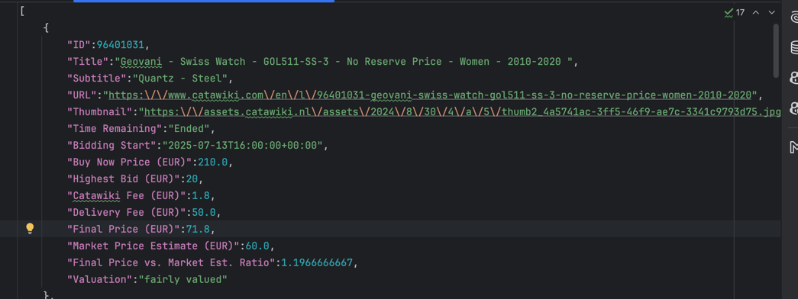

# Catawiki Price Analyzer

This project is a tool for watch enthusiasts to analyze watch prices on Catawiki. It is intended for personal, non-commercial use.

## Description

This script scrapes watch auction data from Catawiki, analyzes it using Google's Gemini API, and provides insights into pricing trends. It's a fun project for anyone interested in watches and data analysis.
The script uses the powerful and free `gemini-2.0-flash` model to provide market estimates. Data is returned and saved in both `.csv` and `.json` formats.

## Features

*   Scrapes watch data from Catawiki.
*   Analyzes prices using the free Gemini API (`gemini-2.0-flash` model).
*   Allows customization of scraping parameters, including search keyword, sorting, filters, and lot limits.

## Setup

1.  **Clone the repository:**
    ```bash
    git clone https://github.com/your-username/catawiki_price_analyzer.git
    cd catawiki_price_analyzer
    ```

2.  **Install dependencies:**
    ```bash
    pip install -r requirements.txt
    ```

3.  **Set up your Gemini API Key:**
    You will need to obtain a Gemini API key from Google AI Studio. Once you have your key, you can either set it as an environment variable or place it directly in the `main.py` script (not recommended for public repositories).

    For example, in `main.py`:
    ```python
    GEMINI_API_KEY = "your_api_key_here"
    ```

## Usage

To run the script, execute the `main.py` file:

```bash
python main.py
```

### Customization

You can easily customize the scraping process by modifying the configuration parameters at the top of the `main()` function in `main.py`:

*   `search_keyword`: Set a search term like `"omega"` or `"rolex"`, or set it to `None` to browse the general watches category.
*   `sort_option`: Controls the order of scraped lots. Options include `"bidding_end_desc"`, `"bidding_end_asc"`, `"price_desc"`, and `"price_asc"`.
*   `filters_string`: Apply URL-encoded filters. For example, `"reserve_price%5B%5D=0&budget%5B%5D=-500"` filters for no-reserve auctions with a budget up to 500 EUR.
*   `max_lots`: The maximum number of lots to fetch. Set to a high number for a full scrape, but be mindful of API rate limits.

## Disclaimer

*   This tool is not intended for commercial use.
*   The Gemini API has a free tier with rate limits. Be mindful of the number of requests you make to avoid being rate-limited. For more information, see the Gemini API documentation.

## Screenshots

